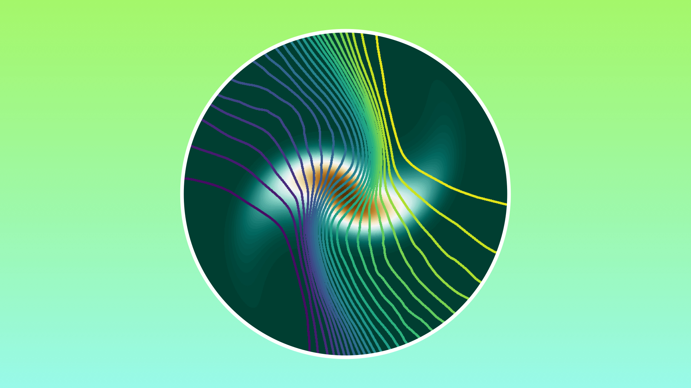

[](https://renormalized-mutual-information.readthedocs.io/en/latest/?badge=latest)
[](https://lbesson.mit-license.org/)


# Renormalized Mutual Information for Artificial Scientific Discovery



This repository shows how to implement the Renormalized Mutual Information described in the paper _"Renormalized Mutual Information for Artificial Scientific Discovery"_ by Leopoldo Sarra, Andrea Aiello and Florian Marquardt.

## Introduction
Renormalized Mutual Information is a quantity that allows to quantify the **dependence** between a given random variable and a **deterministic function** of it. In addition, it  can also be used to extract a low-dimensional feature of a high-dimensional system by maximizing the renormalized mutual information that the feature has with the system.


Usual Mutual Information can't be used in this context, because **it would always diverge** for any choice of the feature. This is due to the deterministic dependence of the feature with the high dimensional variable. The mere addition of noise to mutual information to regularize the divergence is not enough to solve the problem: there is no guarantee that the optimal feature is not affected by the noise.

That's the reason why Renormalized Mutual Information should be used in the context of deterministic and continuous functions of random variables. Please refer to the [paper](https://arxiv.org/abs/2005.01912) for more information.

Here, we show how to implement the **estimation** and **optimization** of Renormalized Mutual Information in the case of low-dimensional features. This case is easier to handle because the entropy of the feature can be estimated efficiently with a histogram.

## Quick Start

Please have a look at the **[quick start notebook](quick-start.ipynb)** for a self-contained introduction to Renormalized Mutual Information!

## Using the library

- git clone this repository
- install the requirements
    - `numpy, scipy, tensorflow, matplotlib, tqdm `  
        - for example, just run from the code folder:
        ``` pip install -r requirements.txt ```
- explore the example notebooks
- try new applications!

For further information, have a look at the **[documentation](https://renormalized-mutual-information.readthedocs.io/en/latest/)**.

## Estimating Renormalized Mutual Information

The class `rmi.estimation` can be directly used to estimate renormalized mutual information, for features that you provide (i.e. expressions f(x) of the high-dimensional variables x). 

To estimate renormalized mutual information, the general workflow is:
- `import rmi.estimation as inf`
- `samples = ...` generate samples, shape `[N_samples, dim_x]`
- define a **feature function**, that should return the feature with shape `[N_samples, dim_feature]` and its gradient with shape `[N_samples, dim_feature, dim_x]`
- `feature, grad = feature_func(samples)`
- `inf.RenormalizedMutualInformation(feature, grad)` returns Renormalized Mutual Information

Please refer to the notebooks for some comments and usage examples.

## Feature Extraction

Feature extraction is about automatically finding the optimal feature for a given distribution of high-dimensional data x. It is implemented in TensorFlow in the class `rmi.nn`.

To apply neural network feature extraction:

- `import rmi.neuralnets as nn`
- define the neural network through a custom Keras model
    ```
        rmi_optimizer = nn.RMIOptimizer(
            layers=[
                nn.K.layers.Dense(30, activation="relu",input_shape=(2,)),
                nn.K.layers.Dense(1)
        ])
    ```
- `rmi_optimizer.compile(optimizer=nn.tf.optimizers.Adam(1e-3))` compile the model
- `rmi_net = nn.Net(rmi_optimizer)` define an object that helps to handle the training through Renormalized Mutual Information maximization
- define a `get_batch` function that takes no arguments and returns a batch of samples
- `rmi_net.fit_generator(get_batch, N_train)` to train the model for `N_train` steps

One can evaluate the output of the network as `rmi_net(samples)`, or get both feature and gradient through `rmi_net.get_feature_and_grad(samples)`.

Please refer to the provided notebooks for examples. 


---
## Citation
If you find this code useful in your work, please cite our article
"Renormalized Mutual Information for Artificial Scientific Discovery", Leopoldo Sarra, Andrea Aiello, Florian Marquardt, arXiv:2005.01912

available on

https://arxiv.org/abs/2005.01912

This work is licensed under a MIT License.
